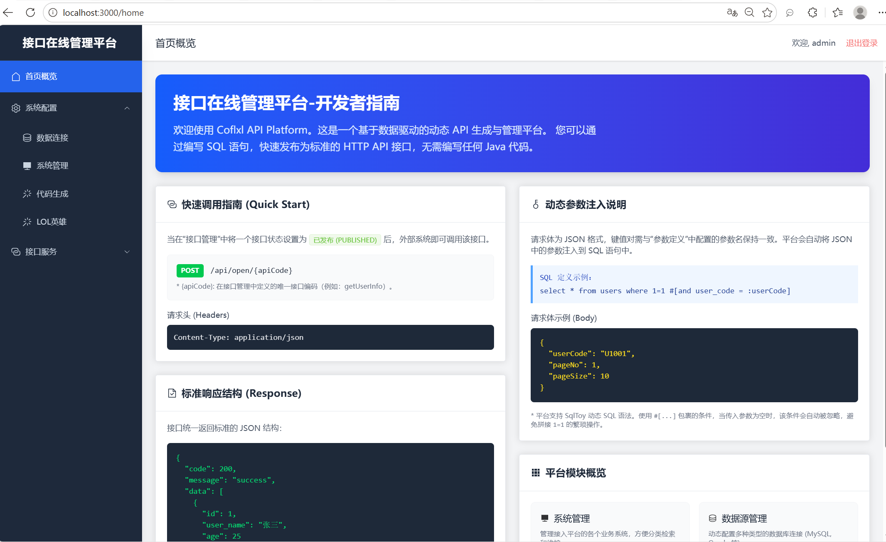
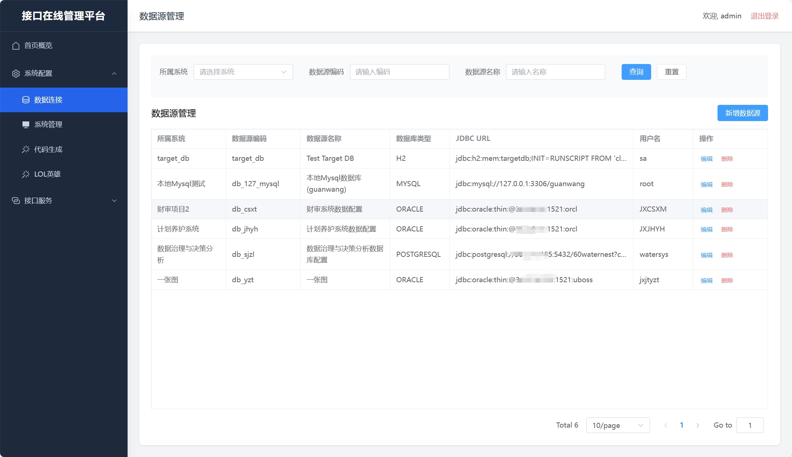
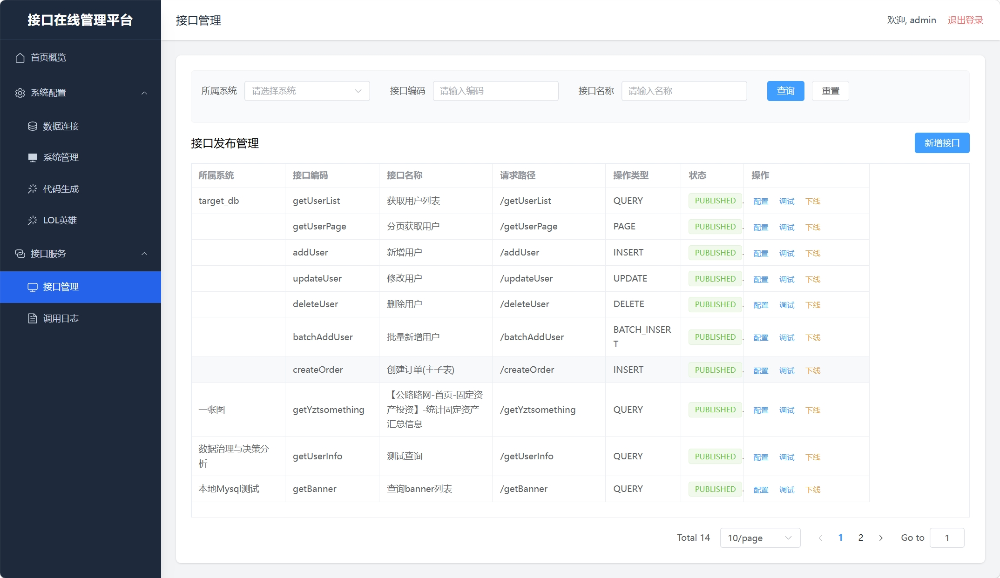
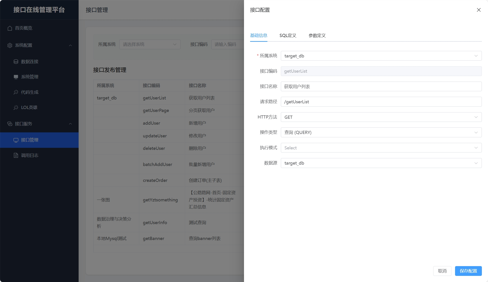
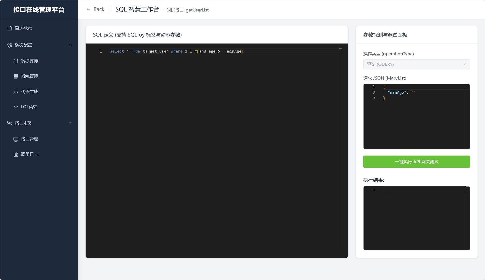
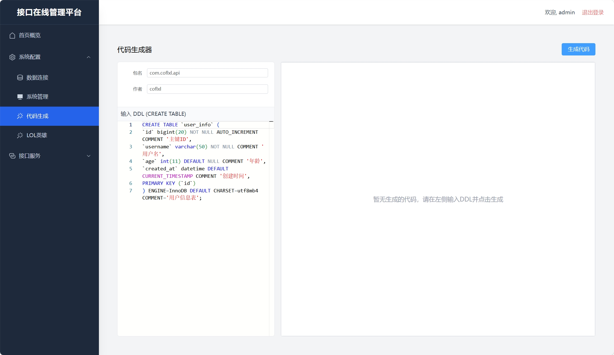
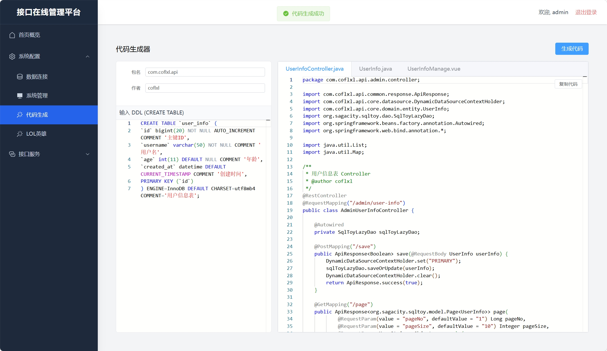
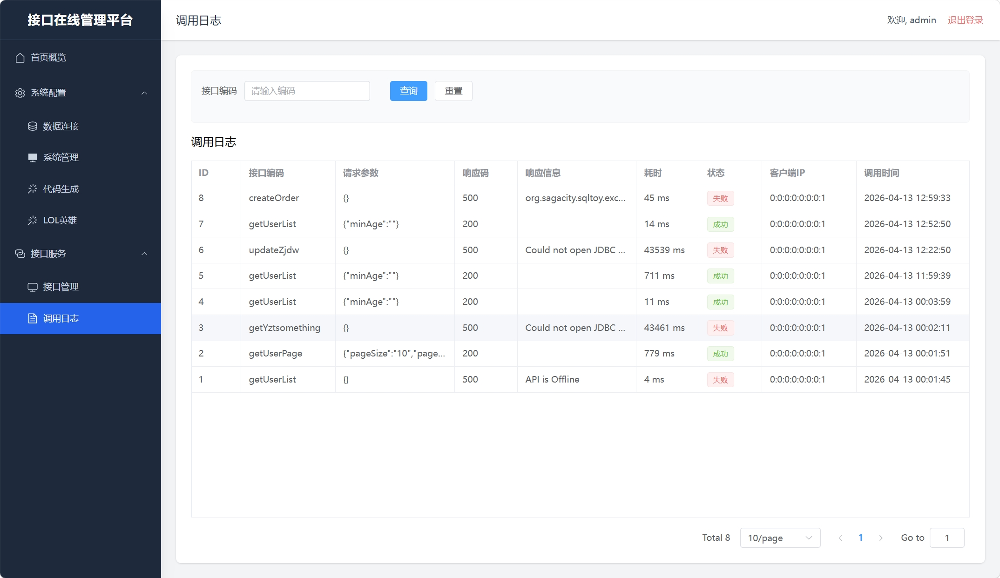

# Coflxl API Platform (动态 API 开放平台)

## 1. 项目简介
Coflxl API Platform 是一个基于数据驱动的动态 API 生成与管理平台。它允许开发者或实施人员通过编写 SQL 语句，快速发布为标准的 HTTP API 接口，无需编写任何 Java 代码。平台支持多数据源管理、多系统归属管理、API 动态发布与下线、SQL 在线调试、接口调用日志记录、**主题切换**、**面包屑导航**和 **Element Plus 组件国际化**。



## 2. 技术栈
*   **后端**: Java 17+, Spring Boot 3, SqlToy (ORM), H2 (内置数据库，支持扩展 MySQL/Oracle/PostgreSQL)
*   **前端**: Vue 3, Vite, TypeScript, Element Plus, Tailwind CSS, Vue Router, Monaco Editor (SQL 编辑器)

## 3. 项目结构

```text
/
├── coflxl-api-platform/                 # 后端工程 (Spring Boot)
│   ├── coflxl-api-platform-admin/       # 管理后台模块 (提供系统、数据源、API管理的 CRUD 接口)
│   ├── coflxl-api-platform-common/      # 公共模块 (统一返回结果、异常处理、常量等)
│   ├── coflxl-api-platform-core/        # 核心模块 (实体类 Entity、动态数据源路由逻辑)
│   └── coflxl-api-platform-gateway/     # 网关/执行模块 (负责接收外部请求，动态执行 SQL 并返回结果)
│
└── coflxl-front/                        # 前端工程 (Vue 3)
    ├── src/
    │   ├── components/                  # 公共组件 (ProTable, MonacoEditor, Breadcrumb等)
    │   ├── router/                      # 路由配置
    │   ├── utils/                       # 工具类 (Axios 封装 request.ts)
    │   └── views/                       # 页面视图
    │       ├── api/                     # 接口/执行相关页面
    │       │   ├── ApiManage.vue        # 接口发布管理
    │       │   ├── SqlWorkbench.vue     # SQL 智慧工作台
    │       │   └── CallLog.vue          # 调用日志
    │       └── system/                  # 系统管理相关页面
    │           ├── SystemManage.vue     # 系统管理
    │           ├── DataSourceManage.vue # 数据源管理
    │           └── CodeGen.vue          # 代码生成
```

## 4. 核心功能模块

### 4.1 系统管理 (System Management)
管理接入平台的各个业务系统（如：财审项目、计划养护系统等）。数据源和 API 接口均可归属到特定的系统下，方便分类检索和维护。

### 4.2 数据源管理 (Data Source Management)
支持动态配置多种类型的数据库连接（MySQL, PostgreSQL, Oracle 等）。平台在执行 API 时，会根据 API 配置的数据源编码，动态切换到目标数据库执行 SQL。



### 4.3 接口管理 (API Management)
核心模块。定义 API 的基础信息（路径、请求方式）、关联数据源、编写 SQL 语句（支持 SqlToy 动态 SQL 语法）并定义入参。



*   **状态流转**: 草稿 (DRAFT) -> 已发布 (PUBLISHED) -> 已下线 (OFFLINE)。
*   **参数自动解析**: 前端支持根据 SQL 文本（如 `:name`）自动提取并同步参数列表。

### 4.4 SQL 工作台 (SQL Workbench)
提供 Monaco Editor 强力支持的 SQL 编写环境，可直接选择已配置的数据源进行 SQL 语句的在线测试和调试。



### 4.5 代码生成 (Code Generation)
提供可视化的代码生成工具，支持根据数据库表结构一键生成后端的 Controller、Service、Entity 以及前端的 Vue 页面。极大减少重复劳动，统一项目规范。




### 4.6 调用日志 (Call Logs)
记录所有通过网关执行的 API 请求细节。包括请求时间、API 编码、入参、执行耗时、响应状态及异常堆栈，方便进行审计、性能分析及线上问题排查。



### 4.7 主题切换 (Theming)
前端支持多套主题（默认深蓝、商务蓝灰、简洁浅色）动态切换，通过修改 `App.vue` 中的 `data-theme` 属性和 `index.css` 中定义的 CSS 变量实现全局样式更新。

### 4.8 面包屑导航 (Breadcrumb Navigation)
应用集成面包屑导航，通过解析 Vue Router 配置中的 `meta.title` 属性，动态生成当前页面的路径层级，提升用户体验和导航清晰度。

### 4.9 Element Plus 国际化 (i18n)
通过在 `main.ts` 中引入并配置 Element Plus 的中文语言包 `zhCn`，实现了对所有 Element Plus 组件（如分页、日期选择器等）的本地化支持。

## 5. 开放接口请求说明 (Open API)

当在“接口管理”中将一个接口状态设置为 **已发布 (PUBLISHED)** 后，外部系统即可调用该接口。

### 5.1 请求地址格式
```http
POST /api/open/{apiCode}
```
*   `{apiCode}`: 在接口管理中定义的唯一接口编码（例如：`getUserInfo`）。

### 5.2 请求头 (Headers)
*   `Content-Type`: `application/json`
*   *(预留)* `Authorization`: `Bearer {token}` (如果接口配置了鉴权)

### 5.3 请求体 (Body)
请求体为 JSON 格式，键值对需与“参数定义”中配置的参数名（`paramCode`）保持一致。

**示例请求:**
```json
{
  "user_name": "张三",
  "user_code": "U1001",
  "pageNo": 1,
  "pageSize": 10
}
```

### 5.4 响应格式 (Response)
接口统一返回标准的 JSON 结构：

**成功响应示例:**
```json
{
  "code": 200,
  "message": "success",
  "data": [
    {
      "id": 1,
      "user_name": "张三",
      "age": 25
    }
  ]
}
```
*(注：如果配置的操作类型为 `PAGE` 分页查询，`data` 字段将包含 `rows` 和 `recordCount` 等分页属性)*

**失败响应示例:**
```json
{
  "code": 500,
  "message": "接口未发布或不存在",
  "data": null
}
```

## 6. 管理端 API 接口目录 (Admin API)

前端页面与后端管理模块交互的内部接口：

*   **系统管理**:
    *   `GET /admin/system/page` (分页查询)
    *   `GET /admin/system/list` (列表查询)
    *   `POST /admin/system/save` (新增/修改)
    *   `POST /admin/system/delete/{systemCode}` (删除)
*   **数据源管理**:
    *   `GET /admin/data-source/page`
    *   `GET /admin/data-source/list`
    *   `POST /admin/data-source/save`
    *   `POST /admin/data-source/delete/{code}`
*   **接口管理**:
    *   `GET /admin/api/page`
    *   `GET /admin/api/detail/{apiCode}`
    *   `POST /admin/api/save`
    *   `POST /admin/api/publish/{apiCode}`
    *   `POST /admin/api/offline/{apiCode}`
*   **网关测试**:\
    *   `POST /admin/api/test` (工作台 SQL 测试)

## 7. 数据库核心表结构说明

*   `sys_api_system`: 系统配置表
*   `sys_api_data_source`: 数据源配置表
*   `sys_api_definition`: API 基础信息定义表
*   `sys_api_sql_definition`: API 关联的 SQL 脚本定义表
*   `sys_api_param_definition`: API 入参规则定义表
*   `sys_api_call_log`: API 调用日志记录表